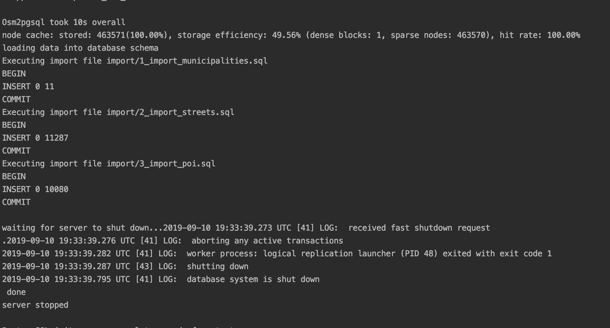
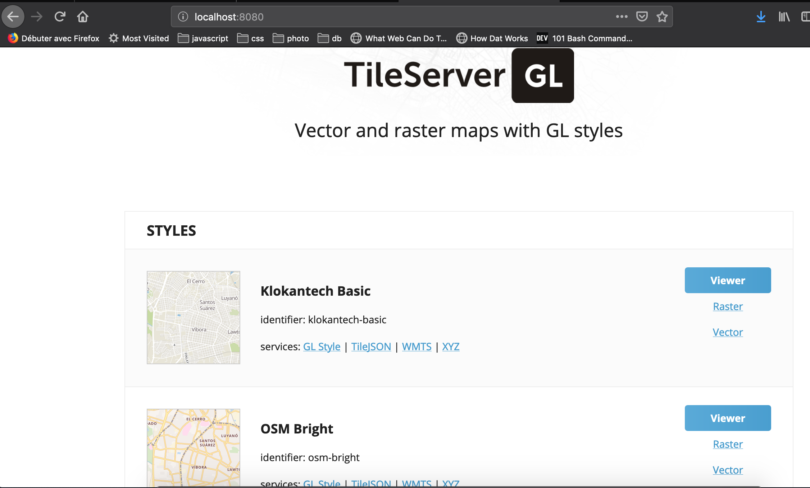
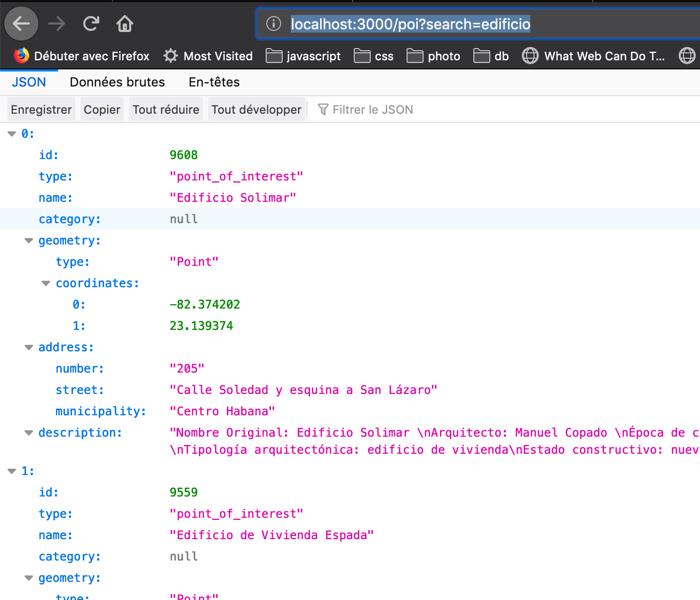

# API

[](https://circleci.com/gh/Citykleta/api-now)

## Getting started (Developer - offline support)

### prerequisites

#### software

You need to have installed on your machine [Docker](https://www.docker.com/) in order to run a database and a tile server.
[Nodejs](https://nodejs.org/en/) must be installed too in order to run the web API server

#### data fixture

If you want the API to return relevant results you should download an open street map data set for La Habana

with curl:
```sh
curl https://overpass-api.de/api/map?bbox=-82.4620,23.0320,-82.2780,23.1840 -o ./scripts/data/havana.osm
```

In the same way you should download tiles for La Habana so you can work on your map even when you are offline (note the tile server used in production will be different - provided by [Mapbox services](https://www.mapbox.com/))
You can go on [openmaptiles.com](https://openmaptiles.com/downloads/central-america/cuba/la-habana/) to download the data and put it in the ./db/scripts/data folder

#### Service accounts

Eventually you will need a free [Mapbox account](https://www.mapbox.com/) to get credentials you can pass with environment variables when running the nodejs server
```sh
export MAPBOX_USER=yourusernamehere
export MAPBOX_token=yourtokenhere
```

Note for the moment route calculation is done with Mapbox and your therefore will require an Internet connection to get route data

### Installation

1. Install Nodejs dependencies by running ``npm install``

2. Start the database with ``./scripts/start_dev_db.sh`` (you might have to set this file executable first)
On UNIX
```sh
chmod +x ./scripts/start_dev_db.sh
```
If everything is fine and you have correctly configured your data fixture should see something like the screen shot below


Note the number of items "INSERTED"

3. Start the tile server by running ``./scripts/start_tile_server.sh`` (in the same way you should make sure the file is executable before)
If everything is fine you can open a browser with the url [http://localhost:8080](http://localhost:8080) and should see an application to view different types of Havana map


4. Build the application by running ``npm run build``. You can now watch for file changes and automatically build the app thanks to ``npm run build:watch``

5. Start now a dev server ``node ./scripts/dev_server.js`` (or with nodemon if you do not want to restart the server on every file change)
To check everything is fine, go to [http://localhost:3000/poi?search=edificio](http://localhost:3000/poi?search=edificio) and you should see some data


## Tests

There are some integration tests which require an actual database connection. You need therefore to start a test database first by running
``./scripts/start_db_test.sh``. Note it will map the container port to the host port number 5433 so that you can have both databases running in the same time: your test database and your dev database 

Then simply run ``npm t``

### Coverage 

You can also have the test coverage by running 

```sh
npm run test:coverage
```

Then see the result by opening the file ``./coverage/index.html``

## Altogether

The previous sections detailed the dev workflow. However you can combine all the previous processes by directly running 

```sh
./scripts/dev.sh
```

This script will
1. start and feed a dev db (on port 5432)
2. start and feed a test db (on port 5433)
3. start a tile server on port 8080
4. watch source files and compile them on changes
5. start a dev server and restart it whenever a source file changes

Note that some of these processes will run in the background and you will need to wait few seconds for example before the databases are available

In the same way closing the bash terminal won't terminate containers so when you want to shut them down you will need to do it explicitly with the following command for example:

```sh
docker container stop $(docker container ls -q);
```
